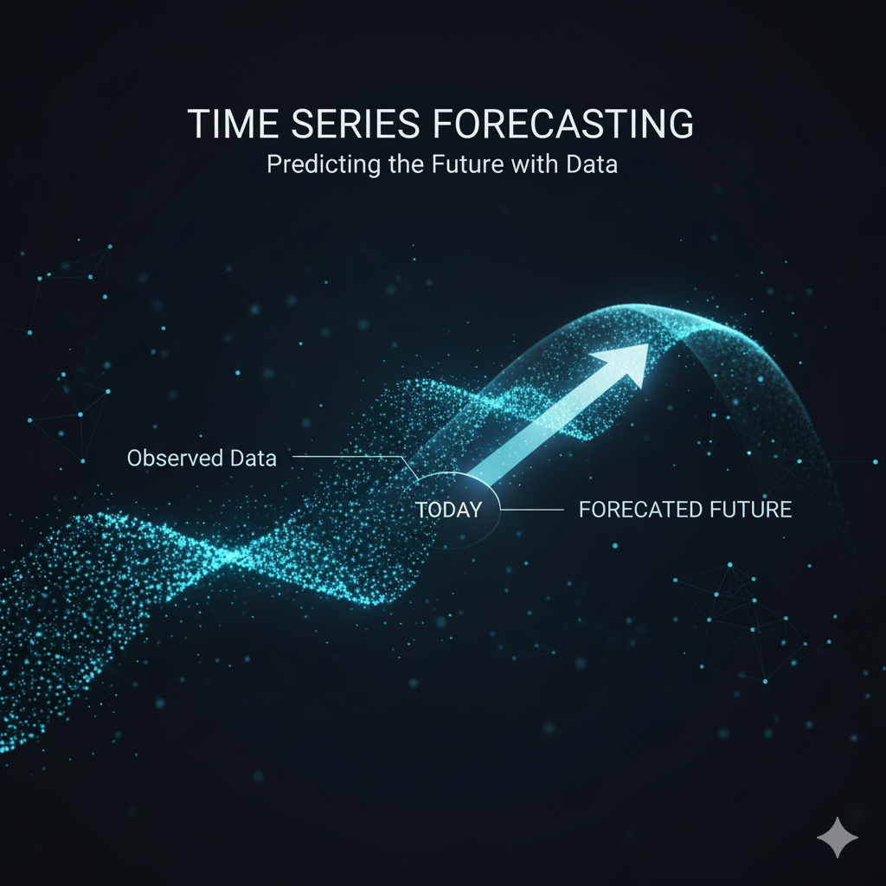

  

# Advanced Time Series Forecasting

  

---

# Summary 

 
  
  The project explores advanced retrieval-augmented-generation (RAG) methods implemented locally using Llama 3. It implements several types of advanced **RAG** workflows including _Multi-Query_, _RAG-Fusion_, _Answer Individually_, _Answer Recursively_, and _Hypothetical Document Embeddings (HyDE)_. The **Multi-Query** method generates multiple queries from a single user prompt to retrieve a richer set of documents.  **RAG-Fusion** uses multiple generated queries plus a “Reciprocal Rank Fusion” style combining of results to improve retrieval relevance. The **recursive** method interleaves reasoning and **retrieval** in steps (reason → retrieve → reason) for complex, multi-step questions.  And **HyDE** uses a generated hypothetical document embedding to perform zero‐shot dense retrieval without labelled relevance data.

  
  

