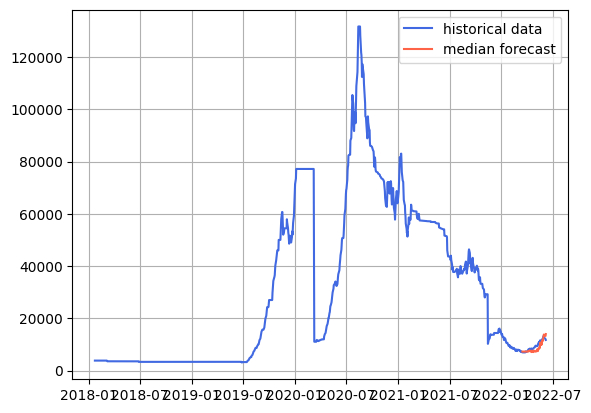
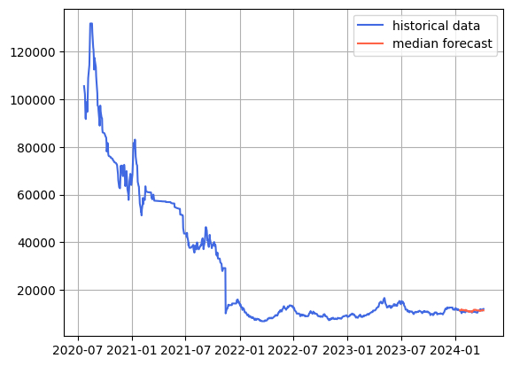

  
# Iran Stock Exchange

 
This project focuses on forecasting the overall index of the Iran Stock Exchange using time series analysis and predictive modeling techniques. It aims to analyze historical stock market data to identify trends, seasonal patterns, and potential future movements in the market index. By applying statistical methods and machine learning algorithms, the project seeks to generate accurate and data-driven predictions that can assist investors, analysts, and policymakers in understanding market behavior and making more informed financial decisions. 

---

  

  
  

---

  

  
  

---
